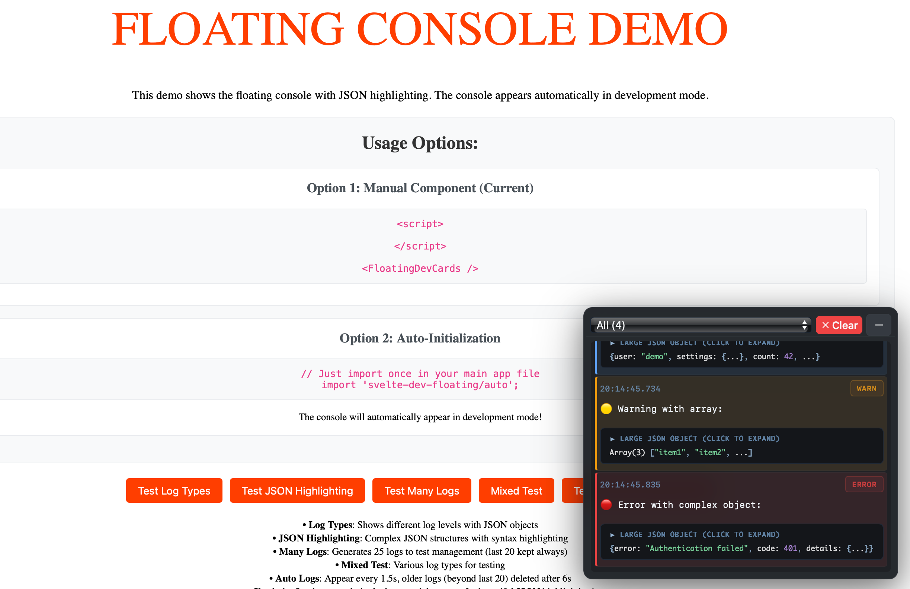

# SV Floating Console

A beautiful floating console for Svelte applications that only appears in development mode. No more opening devtools just to see console logs while debugging! Features JSON syntax highlighting, automatic log management, and a modern dark theme inspired by shadcn/ui.

<a href="https://www.npmjs.com/package/sv-console">
	<picture>
		<source media="(prefers-color-scheme: dark)" srcset="public/readme.png">
		
	</picture>
</a>


## ✨ Features

- 🎨 **Modern Dark UI** - Beautiful shadcn/ui inspired design
- 🔍 **JSON Syntax Highlighting** - Automatic detection and highlighting of JSON objects
- 📱 **Mobile Responsive** - Works perfectly on desktop and mobile
- ⚡ **Smart Log Management** - Keeps last 20 logs, auto-deletes older logs after 6 seconds
- 🚀 **Auto-Scroll** - Automatically scrolls to show latest logs
- 🌙 **Dark Theme Only** - Clean, professional dark interface
- 🔧 **Two Usage Options** - Manual component or auto-initialization
- 💨 **Development Only** - Automatically detects dev mode, invisible in production

## 📦 Installation

```bash
npm install sv-console
# or
pnpm add sv-console
# or
yarn add sv-console
#or 
bun add sv-console
```

## 🚀 Usage


### Option 1: Auto-Initialization (Recommended)

Import once in your main app file and the console will automatically appear:

```javascript
// In your main app.js, main.ts, +Layout.svelte, app.html
import 'sv-console/auto';
```


### Option 2: Manual Component 

Import and use the component in your Svelte app:

```html
<script>
  import { FloatingDevCards } from 'sv-console';
</script>

<FloatingDevCards />

<!-- Your app content -->
<main>
  <h1>My App</h1>
</main>
```

The console will automatically inject itself when in development mode!

## 🔧 Svelte 5 Compatibility

This package is fully compatible with Svelte 5! The auto-initialization automatically detects your Svelte version and uses the appropriate mounting API:

- **Svelte 5**: Uses the new `mount()` API

If you encounter any issues, please use the manual component option instead.

## 🎯 How It Works

### Development Detection
The console uses **strict production exclusion**. It will NOT appear if:

**🚫 Production Indicators (Console HIDDEN):**
- `process.env.NODE_ENV === 'production'` or `'prod'`
- HTTPS protocol with non-localhost hostname
- Standard ports (80, 443, or no port)
- Production domains (non-localhost hostnames)

**✅ Development Indicators (Console SHOWN):**
- `process.env.NODE_ENV === 'development'`
- `localhost`, `127.0.0.1`, or hostnames containing `localhost`
- Local network IPs (`192.168.x.x`)
- Dev server ports (5173, 5174, 3000, 8080, 4000, 8000, 9000)
- URL parameters: `dev`, `debug`, `local`

### Log Management
- **Last 20 logs always preserved** - Never deleted regardless of age
- **6-second cleanup** - Logs beyond the last 20 are deleted after 6 seconds
- **Automatic scrolling** - Always shows the latest logs
- **JSON detection** - Objects are automatically formatted and highlighted

### JSON Highlighting Colors
- **Keys**: Blue (`#66ccff`)
- **Strings**: Green (`#ff6666`) 
- **Numbers**: Purple (`#268d84`)
- **Booleans**: Yellow (`#ffa502`)
- **Null**: Red (`#ff4444`)
- **Brackets/Braces**: Light gray

## 📋 API

### FloatingDevCards Component

The main component with no props needed - it handles everything automatically.

```html
<FloatingDevCards />
```

### Auto-Initialization

```javascript
import 'sv-console/auto';
```

## 🎨 Styling

The component uses a fixed dark theme with modern styling. It's positioned at `bottom: 20px; right: 20px` and has a high z-index (10000) to stay on top.

### Mobile Responsive
- Adapts to smaller screens
- Touch-friendly controls
- Responsive layout

## 🛠️ Development

```bash
# Install dependencies
npm install

# Start development server
npm run dev

# Build for production
npm run build

# Package for publishing
npm run package
```

## 📝 Examples

### Basic Usage
```html
<script>
  import { FloatingDevCards } from 'sv-console';
  
  // This will show up in the console with syntax highlighting
  console.log('User data:', { 
    id: 1, 
    name: 'John', 
    active: true, 
    metadata: null 
  });
</script>

<FloatingDevCards />
```

### Auto-initialization
```javascript
// app.js or main.ts
import 'sv-console/auto';

// The console appears automatically!
console.log('This will show in the floating console');
```

## 🌍 URL Examples

**🟢 Console WILL appear (Development):**
```bash
http://localhost:5173          # Vite dev server
http://localhost:3000          # Next.js dev server  
http://127.0.0.1:8080         # Local dev
https://localhost:5174        # Vite with HTTPS
http://192.168.1.100:3000     # Local network
http://myapp.localhost        # Local domain
https://myapp.dev?debug=1     # Debug parameter
```

**🔴 Console will NOT appear (Production):**
```bash
https://myapp.com             # Production domain
https://myapp.vercel.app      # Vercel deployment  
https://subdomain.myapp.com   # Production subdomain
https://192.168.1.100        # No dev port
http://myapp.com:80          # Standard HTTP port
https://myapp.com:443        # Standard HTTPS port
```

## 🐛 Troubleshooting

### "component_api_invalid_new" Error
If you see this error when using auto-initialization:
```
Attempted to instantiate component with `new Component`, which is no longer valid in Svelte 5
```

**Solution**: The updated package should handle this automatically. If the error persists:

1. **Use the manual component instead**:
   ```svelte
   <script>
     import { FloatingDevCards } from 'sv-console';
   </script>
   <FloatingDevCards />
   ```

2. **Or set Svelte compatibility mode** (in `svelte.config.js`):
   ```js
   export default {
     compilerOptions: {
       compatibility: {
         componentApi: 4
       }
     }
   };
   ```

### Console Not Appearing
- Make sure you're in development mode
- Check that the import is in your main app file
- Ensure no other floating console is already mounted
- Check browser console for any error messages

### Icons Not Loading
- Make sure `@lucide/svelte` is installed: `npm install @lucide/svelte`
- The package should install this automatically as a dependency

## 🤝 Contributing

Contributions are welcome! Please feel free to submit a Pull Request.

## 🗺️ Roadmap

### Core Functions Implementation Status

#### ✅ Completed Features
- [x] **`isDev` detection** - `src/lib/FloatingDevCards.svelte:60-91` - Production/development environment detection
- [x] **`interceptConsole()`** - `src/lib/FloatingDevCards.svelte:168-212` - Console method interception for log capture
- [x] **`addLogEntry()`** - `src/lib/FloatingDevCards.svelte:214-295` - Log processing and JSON detection
- [x] **`cleanupOldLogs()`** - `src/lib/FloatingDevCards.svelte:297-308` - Automatic log cleanup (6s + last 20)
- [x] **`highlightJSON()`** - `src/lib/FloatingDevCards.svelte:403-436` - JSON syntax highlighting
- [x] **`toggleVisibility()`** - `src/lib/FloatingDevCards.svelte:117-119` - Show/hide console panel
- [x] **`togglePositionMenu()`** - `src/lib/FloatingDevCards.svelte:121-138` - Position menu controls
- [x] **`selectPosition()`** - `src/lib/FloatingDevCards.svelte:140-150` - Console positioning system
- [x] **`scrollToBottom()`** - `src/lib/FloatingDevCards.svelte:310-317` - Auto-scroll to latest logs
- [x] **`clearLogs()`** - `src/lib/FloatingDevCards.svelte:319-321` - Clear all console logs
- [x] **`initFloatingConsole()`** - `src/lib/auto.ts:4-11` - Auto-initialization function
- [x] **`mountConsole()`** - `src/lib/auto.ts:13-83` - Dynamic component mounting

#### 🚧 In Development
- [ ] **Network request logging** - Show fetch/XHR requests in console
- [ ] **Theme switching** - Light/dark theme toggle functionality
- [ ] **Performance monitoring** - Track render times and memory usage
- [ ] **Error boundary** - Catch and display component errors

#### 📋 Planned Features
- [ ] **Log search/filtering** - Search through console history
- [ ] **Log export** - Export logs to file
- [ ] **Custom log levels** - Add custom logs levels
- [ ] **Log grouping** - Group similar logs together
- [ ] **Storage persistence** - Save logs across page refreshes
- [ ] **Keyboard shortcuts** - Quick access via hotkeys
- [ ] **Log tagging** - Add custom tags to logs


#### 🔧 Technical Improvements
- [ ] **Bundle size optimization** - Reduce package footprint  
- [ ] **Memory leak prevention** - Better cleanup mechanisms
- [ ] **TypeScript improvements** - Enhanced type safety
- [ ] **Unit test coverage** - Comprehensive test suite
- [ ] **Mobile UX** - Enhanced touch interactions


## 📄 License

MIT License